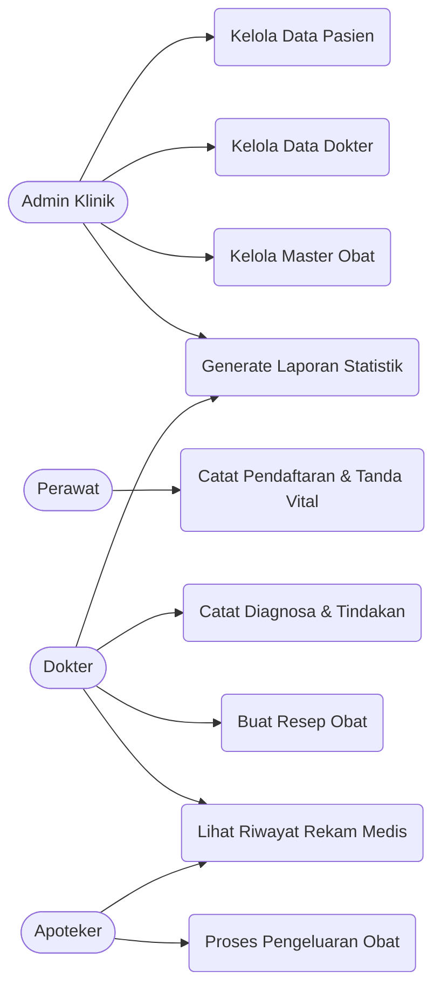

# PROGRES 1: ANALISIS KEBUTUHAN SISTEM
**Mata Kuliah:** Sistem Basis Data  
**Studi Kasus:** Sistem Rekam Medis Klinik  
**Kelompok:** 9  

---

## 1. DESKRIPSI STUDI KASUS
Klinik "Sehat" (nama contoh) saat ini masih menggunakan pencatatan rekam medis kertas dan spreadsheet yang terpisah-pisah antara bagian pendaftaran, ruang pemeriksaan dokter, dan apotek klinik. 

Sistem basis data dirancang untuk mengintegrasikan alur pelayanan klinik, mulai dari pendaftaran pasien, pencatatan, pemeriksaan dan diagnosa, hingga pengeluaran obat. Fokus utama dari proyek ini adalah membangun fondasi basis data relasional yang menjamin integritas data riwayat kesehatan pasien dan akurasi stok obat.

## 2. LATAR BELAKANG DAN TUJUAN SISTEM
### 2.1 Latar Belakang
Pencatatan manual dan penggunaan file spreadsheet terpisah menyebabkan data tidak terstruktur, redundansi data pasien sering terjadi, dan riwayat penyakit pasien sulit dilacak. Selain itu, klinik dapat mengalami ketidaksesuaian antara stok obat fisik dengan catatan di komputer karena tidak adanya pencatatan pengeluaran obat yang terintegrasi dengan resep dokter. Oleh karena itu, diperlukan sebuah sistem basis data yang terpusat.

### 2.2 Tujuan Sistem
1. Merancang basis data rekam medis yang terstruktur dengan normalisasi untuk menghindari redundansi dan "anomali" data.
2. Mengintegrasikan data master (pasien, dokter, obat) dengan data transaksional (kunjungan, diagnosa, resep).
3. Menjamin integritas data riwayat kesehatan pasien agar mudah ditelusuri.
4. Menyediakan query untuk menghasilkan laporan statistik penyakit terbanyak dan mutasi stok obat.

## 3. IDENTIFIKASI AKTOR
Sistem ini akan berinteraksi dengan beberapa aktor utama dalam operasional klinik:
1. **Admin Klinik:** Bertanggung jawab atas pengelolaan data master (data pasien, data dokter, dan data master obat).
2. **Perawat:** Bertanggung jawab atas pendaftaran kunjungan pasien dan pencatatan tanda vital awal (seperti tensi, suhu, berat badan).
3. **Dokter:** Bertanggung jawab melakukan pemeriksaan, mencatat hasil diagnosa, dan memberikan resep obat.
4. **Apoteker:** Bertanggung jawab memverifikasi resep dan mencatat pengeluaran obat dari inventori klinik.

## 4. KEBUTUHAN FUNGSIONAL
Berikut adalah minimal 10 kebutuhan fungsional yang harus dapat difasilitasi oleh struktur basis data:
1. Sistem harus mampu menyimpan dan mengelola data master pasien (NIK, Nama, Tgl Lahir, Jenis Kelamin, Alamat, No. Telp).
2. Sistem harus mampu mengelola data dokter beserta spesialisasi dan jadwal praktiknya.
3. Sistem harus mampu mencatat setiap kunjungan pasien (Tanggal, Keluhan Awal, Dokter yang menangani).
4. Sistem harus mampu merekam tanda vital pasien saat pemeriksaan (Tensi, Suhu, Berat Badan).
5. Sistem harus mampu mencatat hasil diagnosa (termasuk kode ICD-10 jika ada) dan tindakan medis oleh dokter.
6. Sistem harus mampu mencatat detail resep obat yang diberikan dokter kepada pasien (Nama obat, dosis, jumlah).
7. Sistem harus mampu mengelola inventori/stok obat di klinik (Kategori, Stok saat ini, Harga, Satuan).
8. Sistem harus mampu mencatat riwayat pengeluaran obat dari stok berdasarkan resep yang telah dibuat.
9. Sistem harus mampu menampilkan riwayat rekam medis lengkap seorang pasien (semua kunjungan dan diagnosa) berdasarkan ID Pasien.
10. Sistem harus mampu menghasilkan laporan statistik penyakit yang paling sering didiagnosis dalam periode tertentu.
11. Sistem harus mampu menghasilkan laporan obat yang paling sering diresepkan untuk kebutuhan pengadaan stok.

## 5. KEBUTUHAN DATA (ENTITAS KANDIDAT)
Berdasarkan analisis kebutuhan, berikut adalah entitas-entitas awal yang diidentifikasi untuk membentuk basis data:
1. **PASIEN**: Menyimpan data demografis dan kontak pasien.
2. **DOKTER**: Menyimpan data identitas dan keahlian dokter.
3. **KUNJUNGAN**: Menyimpan header transaksi pemeriksaan (Tanggal, Keluhan, Tanda Vital).
4. **DIAGNOSA**: Menyimpan detail hasil pemeriksaan dokter terkait kunjungan.
5. **OBAT**: Menyimpan data master inventori obat.
6. **DETAIL_RESEP**: Menyimpan relasi antara kunjungan, obat yang diresepkan, dosis, dan jumlah.

## 6. DIAGRAM PROSES (USE CASE)
Berikut adalah pemodelan Use Case yang menggambarkan interaksi aktor dengan sistem basis data yang akan dibangun:

